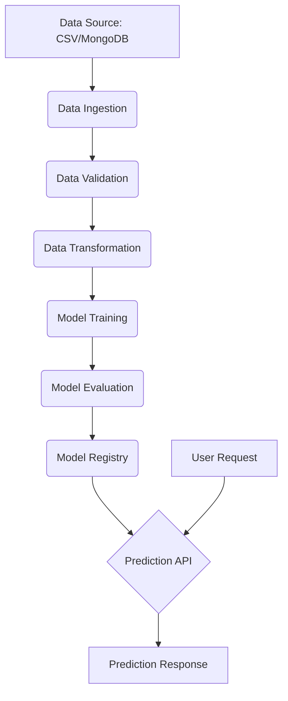

# Network Security Phishing Detection

## 📖 Overview

This project is a sophisticated machine learning application designed to detect phishing attempts with high accuracy. It features a complete end-to-end pipeline, from data ingestion and processing to model training and deployment. The project is built with a modern tech stack, including a FastAPI backend for the RESTful API and MLflow for robust experiment tracking.

This application serves as a strong demonstration of building and deploying a production-ready machine learning system.

## 🚀 Key Features

*   **End-to-End ML Pipeline:** A fully automated pipeline that covers data ingestion, validation, transformation, model training, and evaluation.
*   **RESTful API:** A high-performance API built with FastAPI that exposes the model's prediction capabilities.
*   **Experiment Tracking:** Integrated with MLflow for comprehensive tracking of all training runs, including parameters, metrics, and artifacts.
*   **Scalable Data Handling:** Utilizes MongoDB for efficient storage and retrieval of large datasets.
*   **Modular and Maintainable Code:** The project follows a modular structure, separating concerns for easy maintenance and scalability.

---

## 🛠️ Tech Stack

*   **Backend:** Python, FastAPI
*   **Database:** MongoDB
*   **ML Libraries:** Scikit-learn, Pandas, NumPy
*   **MLOps:** MLflow, DagsHub
*   **Deployment:** Uvicorn

---

## 📈 Architecture




## ⚙️ Installation

**1. Clone the repository:**

git clone https://github.com/Palak2811/network-security-ml.git
cd network-security-ml
**2. Create a virtual environment:**
source venv/bin/activate # For Linux/Mac
venv\Scripts\activate # For Windows

**3. Install dependencies:**
pip install -r requirements.txt

**4. Set up environment variables:**

Create a `.env` file in the root directory and add your MongoDB connection string:

```
MONGODB_URL_KEY="your_mongodb_connection_string"
```

---

## ▶️ How to Run

**1. Run the FastAPI application:**
uvicorn app:app --reload

The API will be available at `http://127.0.0.1:8000`.

**2. Train the model:**

To trigger the training pipeline, you can send a `GET` request to the `/train` endpoint or access it through the API documentation.

---

## 📡 API Endpoints

*   `GET /`: Redirects to the API documentation.
*   `GET /train`: Triggers the model training pipeline.
*   `POST /predict`: Makes a prediction on new data.

You can access the interactive API documentation at `http://127.0.0.1:8000/docs`.
